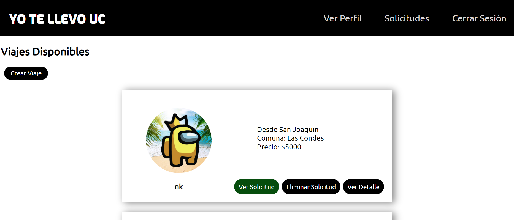
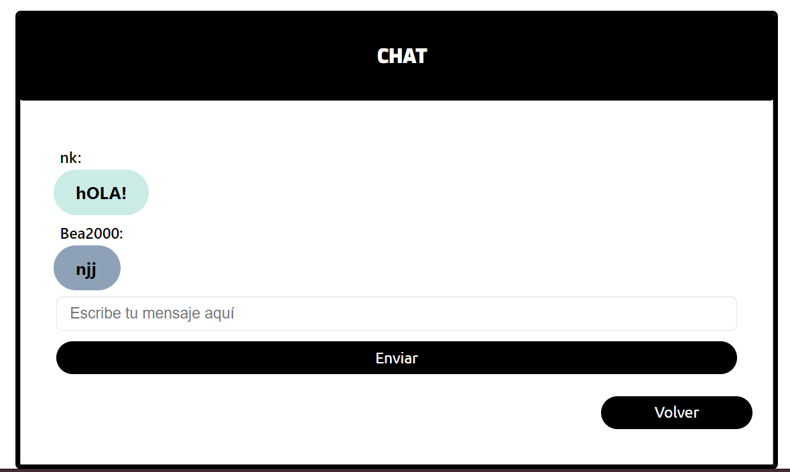

# University Ride Sharing App

This project was developed for the **Web Technologies and Applications** course and is a ride-sharing application that connects users traveling to or from a university or district. The app allows users to manage trips, view trip details, handle ride requests, and communicate with other users through a chat feature. The platform includes user authentication with encrypted passwords for security.






## Features

- **User Authentication**: Users can sign up and log in with encrypted passwords for secure access.
- **Trip Management**: Users can create, view, and manage trips, including details like departure, destination, time, and cost.
- **Ride Requests**: Users can request a ride or offer one to other members of the platform.
- **Chat Feature**: Integrated chat functionality allows users to communicate directly about trip arrangements.
- **Trip Details**: View all relevant details for each trip, such as driver information, price, and schedule.
- **Rating System**: Users can rate each other after a trip to provide feedback and improve the platform.

## Technologies Used

- **Frontend**: React
- **Backend**: Express.js
- **Database**: Sequelize ORM with a PostgreSQL database
- **Authentication**: Encrypted passwords using bcrypt
- **Communication**: Chat between users

## Getting Started

To run the project locally, follow these steps:

### Prerequisites

- Node.js
- PostgreSQL

### Installation

1. **Clone the repository**:

   ```bash
   git clone https://github.com/your-username/your-repo-name.git
   cd your-repo-name
    ```

2. **Install dependencies**:

   ```bash
   cd frontend
   npm install
   cd ../backend
   npm install
   ```

3. **Set up the database**: Create a PostgreSQL database and update the connection string in the `.env` file.

    ```bash
    DB_HOST=localhost
    DB_USER=your-username
    DB_DATABASE=your-database
    DB_PASSWORD=your-password
    DB_PORT=5432
    ```

4. **Run the migrations**:

    ```bash
   npx sequelize-cli db:migrate
    ```

5. **Start the backend server**:

    ```bash
    npm run dev
    ```

6. **Start the frontend server**:

    ```bash
    cd frontend
    npm run start
    ```

7. **Open your browser**: Navigate to `http://localhost:3000` to view the app.
